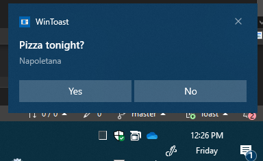
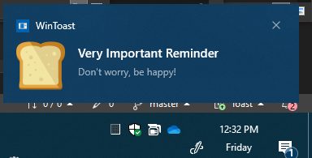

# WinToast - Toast Notification Generator

Command-line utility to generate toast notifications on Windows 10/11. Toast notifications can include text, attributes, images, and action buttons.

# Switches
```
Usage: WinToast.exe [SWITCHES]
      --text          (optional) : sets the text for the notifications
      --attribute     (optional) : sets the attribute for the notification
      --action        (optional) : sets the actions in buttons
      --appname       (optional) : sets the default appname
      --appid         (optional) : sets the App User Model Id (AUMI)
      --expires       (optional) : sets the expiration time in seconds
      --image         (optional) : sets the image absolute path
      --only-create-shortcut  (optional) : creates the shortcut for the app
      --audio-state   (optional) : sets the audio state: Default = 0, Silent = 1, Loop = 2
      --help          (optional) : prints this help
```

# Examples

WinToast.exe --text "Pizza tonight?" --attribute "Napoletana" --action Yes --action No




WinToast.exe --image "C:\Temp\189122.png"




# Download

https://github.com/leonardomsft/WinToast/releases/download/v1/WinToast.exe

# More on Toast Notifications

## App User Model Id (AUMI)
Any app sending a toast notification requires a shell shortcut specifying the App User Model ID property, otherwise the notification may not display correcly. Wintoast automatically creates and maintains this shortcut in the %APPDATA% location.
  
## Expiration vs Duration
Expiration defines how long the toast notification will remain in the Action Center. Duration is the time it will be visible on the screen.
Before expiration, the notification can still be seen in the Action Center. After expiration, it's deleted and completely disappears.
Duration depends on the template used and can be either "short" or "long". Wintoast uses the "ToastGeneric" template and defines "short" notifications, which results in a duration of approximately 6 seconds, after which the toast times out.

## Resources

Send a local toast notification from a WRL C++ desktop app

  https://learn.microsoft.com/en-us/windows/apps/design/shell/tiles-and-notifications/send-local-toast-desktop-cpp-wrl


How to enable desktop toast notifications through an AppUserModelID

https://learn.microsoft.com/en-us/previous-versions/windows/desktop/legacy/hh802762(v=vs.85)

